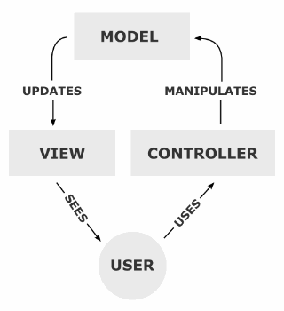

# Тестовое задание

Разработать desktop приложение, на qml с похожим интерфейсом.
Где по центру расположен счетчик. По бокам кнопки для уменьшения, увелечения счетчика. Использовать подход MVC, бекенд на C++, фронтенд на qml.

## Рассмотренные подходы

### Общее
На qml реализовано окошко в файле ```main.qml```. На языке С++ реализованы классы ```View```, ```Controller```, ```Model``` для реализации следующей архитектуры:
.

Класс ```View``` является некоторым посредником, и он содержится в qml-файле и также создает в себе контроллер и модель (потому что я не узнал пока как извлечь его в С++ коде). Также этот класс содержит сигнал ```numberChanged```, который связан с одноименным сигналом класса ```Model```. Благодаря методам ```number()```, ```setNumber()``` и сигнана ```numberChanged``` обеспечивается доступ к числу из qml до модели.

Также для лучшей демонстрации того, что при обновлении данных в модели, представление обновляется сразу же, добавлена кнопка ```Set random number```.


### 1. Использовать в качестве счетчика готовый SpinBox.
Самый простой способ, дополнительно использовал стиль```Imagine```. Но оказалось тяжело без костылей реализовать присваивание рандомного числа


### 2. Объединение связки Button-Label-Button в один Rectangle
Добавлены методы ```inc()```  и ```dec()``` в классы на C++. Но при этом значение в ```Label``` связано со значеним во ```View```, а не наоборот как было в первом случае
   
   


